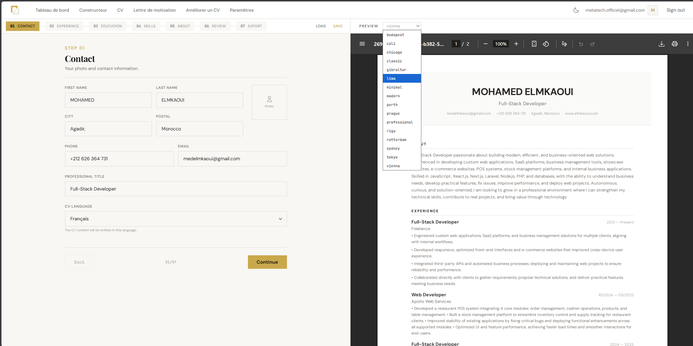
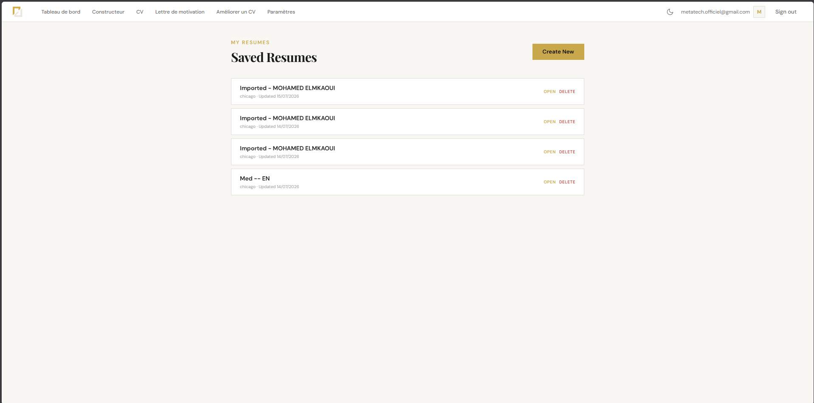

# CV Builder — Case Study

> **Live Demo:** [cv.elmkaoui.com](https://cv.elmkaoui.com)
>
> Sign in with Google to create and export professional resumes.

---

## Overview

An AI-powered resume builder that enables job seekers to create professional, ATS-friendly CVs in minutes. The platform combines recruiter-approved templates with AI-assisted content generation, supporting multiple languages (English, French, Arabic) with full RTL layout support.

---

## The Problem

Job seekers in Morocco and beyond face a fragmented resume-building workflow:

- **Generic templates** from word processors that aren't ATS-optimized
- **Manual formatting** that breaks when switching between Word, PDF, and online portals
- **No AI assistance** to improve bullet points, summaries, or translations
- **Language barriers** — applications often require CVs in French, English, or Arabic
- **No centralized storage** — resumes scattered across devices and formats

The goal was to build a **single, intuitive platform** where users can create, store, and export professional resumes with AI-powered assistance — all from the browser.

---

## Solution

A full-stack resume builder with:

- **Step-by-step wizard** — Contact → Experience → Education → Skills → About → Review → Export
- **AI content generation** — Bullet points and professional summaries via OpenRouter (LLaMA)
- **16 professional templates** — ATS-optimized designs with live preview
- **Multi-language CVs** — Write content in English, French, or Arabic with RTL support
- **PDF export** — Pixel-perfect A4 PDFs rendered via Playwright
- **AI cover letters** — Generate tailored cover letters alongside your CV
- **CV rating** — AI-powered feedback on resume quality
- **Upload & parse** — Import existing PDF/DOCX/TXT resumes with AI text extraction
- **Light/dark mode** — Theme toggle with localStorage persistence
- **User isolation** — Each user sees only their own saved resumes via Google OAuth

---

## Pages Walkthrough

### Landing (Light & Dark Themes)

The landing page introduces the product with dual-theme support. Users can toggle between light and dark modes instantly, with the preference persisted across sessions. The hero section showcases the value proposition, template grid, pricing, and frequently asked questions.

| Light Theme | Dark Theme |
|---|---|
|  |  |

### Resume Builder

The builder is a 7-step form wizard. Each step has its own section with form fields, AI generation buttons, and validation. The interface supports three interface languages (EN/FR/AR) that switch automatically when the user changes the CV language. The right panel shows a live PDF preview that updates in real-time as fields are filled.

### Saved Resumes

Each authenticated user has their own resume storage. The dashboard shows a list of saved resumes with the ability to open, edit, or delete them. All data is isolated per user — no one can access another user's resumes.

### Cover Letter Generator

Generate tailored, context-aware cover letters alongside CVs. The AI adapts the tone and content based on the target position and company, producing professional letters ready for download.

---

## Key Features

### 🧠 AI-Powered Content
- Generate bullet points for each work experience with context-aware AI
- Write professional summaries in one click
- Rate your CV's quality and get actionable improvement suggestions
- Parse uploaded resumes and extract structured data via AI

### 📐 16 Professional Templates
- ATS-optimized designs (Chicago, Onyx, Sunline, Keyline, FleetWise, MultiBranch)
- Live preview updates in real-time as you type
- Template selector with visual thumbnails
- Download all templates at once with your data

### 🌍 Multi-Language & RTL
- Write CV content in English, French, or Arabic
- UI translates instantly when CV language changes
- Full RTL support for Arabic (Cairo font)
- French and Arabic spoken natively by the developer

### 🎨 Light & Dark Mode
- Full theme system with CSS custom properties
- Toggle in landing navbar, dashboard header, and mobile nav
- No-flash inline script prevents theme flicker
- Persistent across sessions via localStorage

### 🔒 User Isolation & Security
- Google OAuth authentication via NextAuth v5
- Resume CRUD filtered by authenticated user email
- Python backend validates ownership on every read/update/delete
- API proxy routes enforce session checks before forwarding requests

### 📄 Export & Sharing
- Pixel-perfect A4 PDF export via Playwright (Chromium)
- Multi-page preview with page-break indicators
- Cover letter PDF generation
- All 16 templates downloadable in one click

---

## Tech Stack

| Technology | Purpose |
|---|---|
| **Next.js 16** | App Router, server components, API route proxies |
| **React 19** | Client component architecture |
| **TypeScript** | Type safety across frontend and backend |
| **Tailwind CSS 4** | Utility-first styling with dark mode via CSS vars |
| **FastAPI (Python 3.12)** | Async REST API with SQLAlchemy + SQLite |
| **Playwright** | PDF and PNG rendering via headless Chromium |
| **Auth.js v5 (NextAuth)** | Google OAuth with JWT session management |
| **OpenRouter API** | AI content generation (LLaMA, etc.) |
| **PyMuPDF & python-docx** | PDF/DOCX text extraction for resume upload |
| **Jinja2** | HTML template rendering for PDF export |
| **nginx + pm2** | Reverse proxy and process management |
| **Let's Encrypt** | SSL/TLS certificates |
| **i18n** | Custom locale system with EN/FR/AR translations |

---

## My Role

I owned the full development lifecycle:

1. **Product design** — defined the user journey (landing → builder → export)
2. **UI/UX** — designed the step wizard, template system, and theme toggle
3. **Architecture** — chose Next.js + FastAPI split, designed the proxy pattern
4. **Full-stack implementation** — built every feature end-to-end
5. **PDF pipeline** — set up Playwright rendering with A4 formatting and page splitting
6. **AI integration** — connected OpenRouter for content generation and CV rating
7. **Authentication** — implemented Google OAuth with session management
8. **Data isolation** — enforced per-user scoping across frontend proxies and Python backend
9. **i18n system** — built custom locale provider with RTL support and auto-switching
10. **Deployment** — configured Ubuntu server, nginx, pm2, SSL, and domain
11. **Maintenance** — fixed PDF/preview paths for Linux, added missing Python deps

---

## Impact

- ✅ **Production-ready** — deployed and accessible at cv.elmkaoui.com
- ✅ **Multi-tenant** — each user's data securely isolated
- ✅ **AI-powered** — content generation and quality rating built in
- ✅ **Professional output** — recruiter-approved templates with ATS optimization
- ✅ **Accessible** — English, French, and Arabic with RTL support
- ✅ **Import existing CVs** — parse and restructure from any format

---

## What This Demonstrates

This project showcases:

- **Full-stack SaaS architecture** — Next.js frontend + FastAPI backend
- **Real AI integration** — not just a wrapped API call, but context-aware generation
- **Production deployment** — live at a custom domain with SSL, proxy, and process management
- **Data security** — per-user isolation across the entire stack
- **Multi-language UX** — interface that adapts to content language dynamically
- **Complex rendering pipeline** — HTML → PDF via headless browser
- **Theme system** — light/dark mode without a library dependency

---

## Relevant For

Clients and teams looking for:

- AI-powered web applications
- Resume builders & job search platforms
- SaaS products with user accounts and data isolation
- Multi-language applications with RTL support
- Full-stack Next.js + Python projects
- Document generation and PDF rendering systems

---

## Contact

- **Live Demo:** [cv.elmkaoui.com](https://cv.elmkaoui.com)
- **Portfolio:** [elmkaoui.com](https://elmkaoui.com)
- **GitHub:** [github.com/ElmkaouiMed](https://github.com/ElmkaouiMed)
- **Email:** [medelmkaoui@gmail.com](mailto:medelmkaoui@gmail.com)
