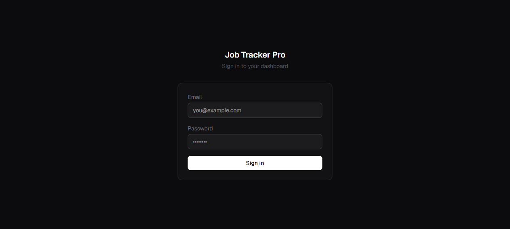
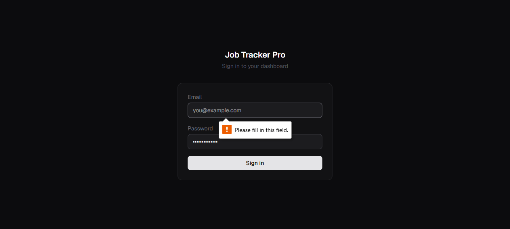
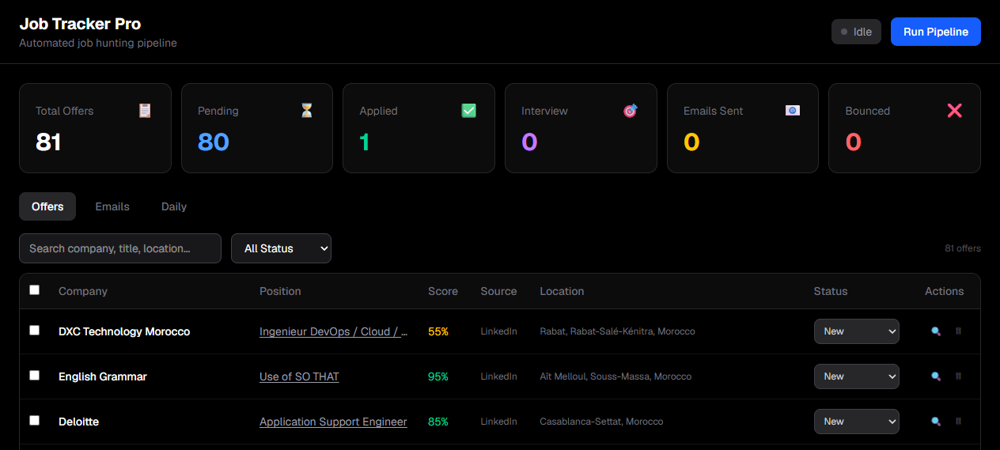

# Job Tracker Pro — Automated Dual-Axis Job Hunting Pipeline

> A fully automated job hunting system that runs 24/7 on a VPS, combining AI-powered job matching with company prospecting and cold email outreach — all behind a real-time mobile-first dashboard.

---

## The Problem

Job hunting is time-consuming and repetitive: searching multiple boards, evaluating fit, finding the right contacts, writing personalized emails, and tracking responses. Most job seekers spend 4-6 hours daily on this — and miss opportunities on platforms they don't check.

---

## The Solution

A dual-axis automated pipeline that handles the entire job search workflow:

- **Axis 1 — Job Offers**: Scrapes LinkedIn, Google Jobs, and Emploi-Maroc twice daily. AI scores each offer against a detailed profile (36+ skills, bilingual queries, role blacklist). Sends personalized cold emails with portfolio links and CV attachment.

- **Axis 2 — Company Prospecting**: Discovers companies by tech stack and industry. Enriches with website data, tech detection, and company size. Finds decision-maker contacts (emails + phone numbers). Builds an outreach pipeline.

A real-time dashboard provides full visibility: Companies, Offers, Emails, and Daily stats — with search, filter, bulk actions, and on-demand pipeline control.

---

## Architecture

```
Dual-Axis Pipeline (Python 3.11 + Flask)
├── Axis 1: Job Offers
│   ├── Multi-source scraping (LinkedIn, Google Jobs, Emploi-Maroc)
│   ├── AI scoring (OpenAI GPT-4o, threshold: 65%)
│   ├── Strict email verification (MX/SMTP, disposable detection)
│   └── Cold email outreach (Gmail SMTP + CV + portfolio)
│
├── Axis 2: Company Prospecting
│   ├── Company discovery (Google + LinkedIn by stack/industry)
│   ├── Website enrichment (tech detection, size, industry)
│   ├── Decision-maker finder (email + phone extraction)
│   └── Outreach pipeline tracking
│
└── Dashboard (Next.js 16 + Tailwind)
    ├── Companies tab (primary view)
    ├── Offers tab (status management)
    ├── Emails tab (sent log + bounce tracking)
    └── Daily tab (pipeline run history)
```

---

## Tech Stack

| Layer | Technology |
|-------|-----------|
| Frontend | Next.js 16, React, Tailwind CSS |
| Backend | Python 3.11, Flask, SQLite |
| AI | OpenAI GPT-4o |
| Email | Gmail SMTP, Hunter.io |
| Search | LinkedIn (Serper API), Google Jobs, Emploi-Maroc |
| Auth | HMAC-signed httpOnly session cookies |
| Deploy | Ubuntu 24.04 VPS, Nginx, Systemd, PM2 |

---

## Key Features

### AI-Powered Scoring
GPT-4o evaluates each offer against a 36-skill profile, weighing domain fit, experience level, and deal-breakers. Only offers scoring above 65% make it through.

### Bilingual Search
Queries run in both English and French to cover Morocco's bilingual job market. Industry-specific and role-focused search terms maximize relevant results.

### Strict Email Verification
Before sending any outreach, emails go through MX record validation and SMTP deliverability checks. Disposable email domains are automatically blocked.

### Company Intelligence
Automatically detects tech stacks (React, Next.js, Laravel, etc.) from company websites, identifies decision-makers, and extracts contact information.

### Pipeline Controls
- Capped at 10 job offers/day (Axis 1)
- 20 companies per run (Axis 2)
- 3 contacts per company
- Runs at 07:00 & 15:00 UTC daily
- On-demand trigger from dashboard or CLI

---

## Dashboard

### Login


### Companies Dashboard


### Pipeline in Action


---

## Results

- **115+ offers processed** in initial deployment
- **260+ companies identified** with contact information
- **Dual-axis coverage** — job boards + direct company outreach
- **Fully automated** — runs twice daily without manual intervention

---

## Links

- **Repository:** [github.com/ElmkaouiMed/JOB_TRACKER](https://github.com/ElmkaouiMed/JOB_TRACKER)
- **Live Dashboard:** [jobtracker.elmkaoui.com](https://jobtracker.elmkaoui.com)

---

*Built as a personal tool to automate the job search process — from discovery to outreach.*
