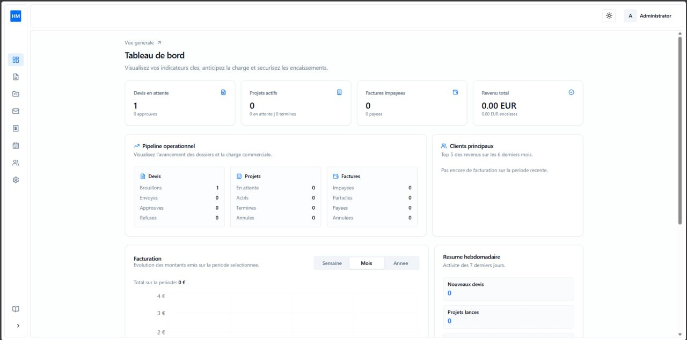
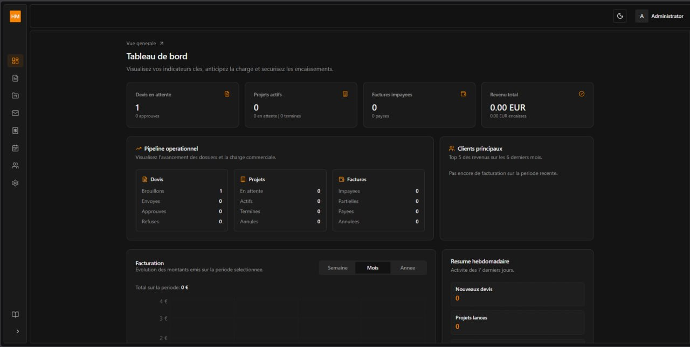
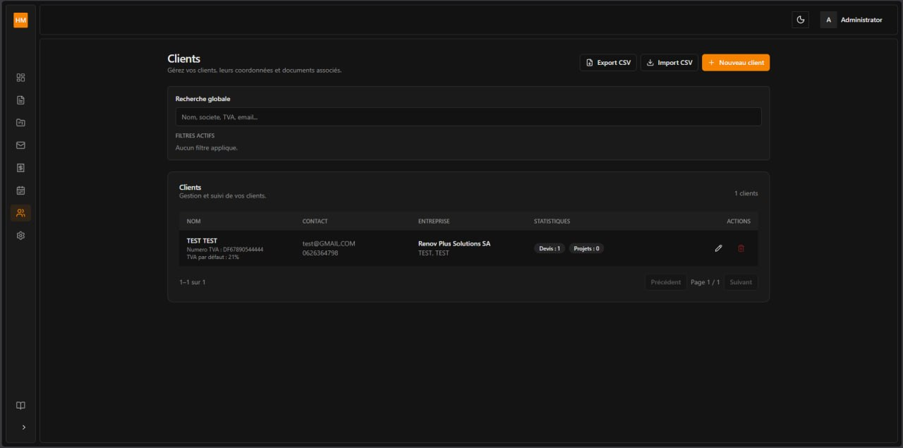
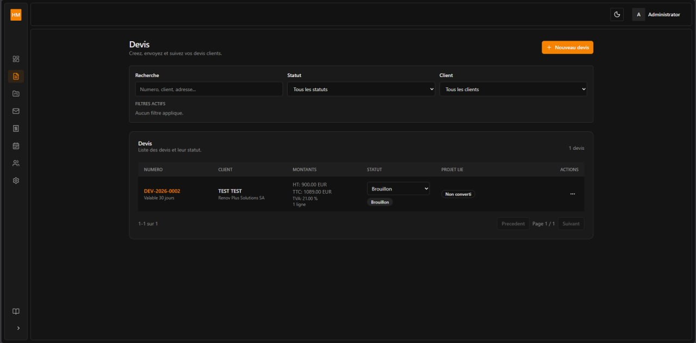
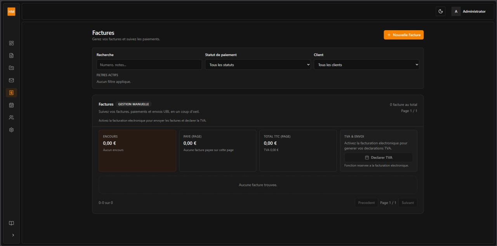
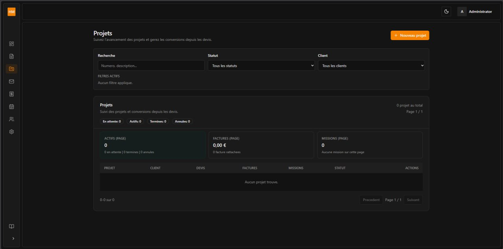
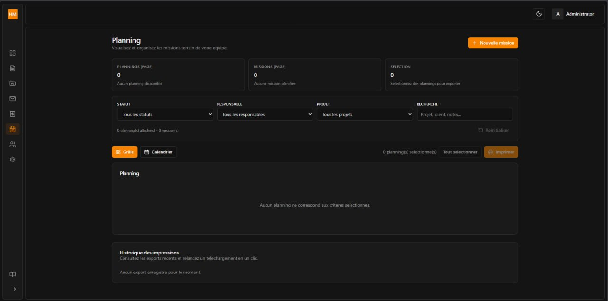
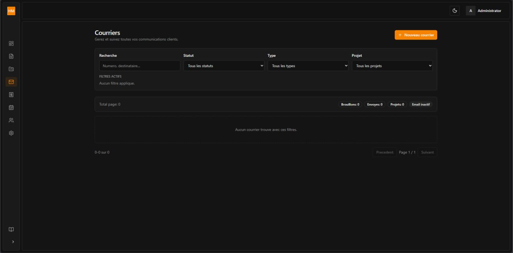
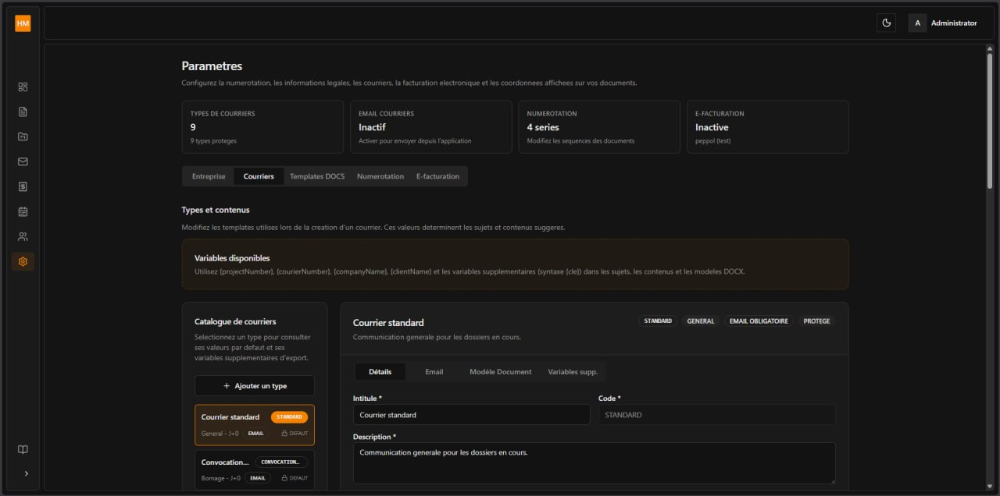

# Topography Office Dashboard — Case Study

> **Live Demo:** [hmtop.elmkaoui.com/dashboard](https://hmtop.elmkaoui.com/dashboard)
>
> Demo access: `admin@topography.local` / `admin1234`

---

## Overview

A complete business management dashboard built for a Moroccan topography (surveying) office. The platform centralizes daily operations — client management, project tracking, document handling, invoicing, and team coordination — replacing a fragmented workflow of Excel sheets, paper folders, and WhatsApp messages.

---

## The Problem

Topography offices typically manage their workflow using a combination of disconnected tools:

- **Excel files** for project and client tracking
- **Paper documents** and physical folders for contracts and permits
- **WhatsApp messages** for team communication and approvals
- **Email** for client exchanges and invoice sending

This leads to:
- Lost or duplicate information
- No centralized view of project status
- Delayed invoice tracking and payment follow-up
- Difficulty onboarding new team members
- No clear audit trail

The goal was to replace this chaos with a **single, private web application** that any team member can use from the office or on-site.

---

## Solution

A role-based internal dashboard where the office can:

- Track **clients** and their contact details, documents, and project history
- Manage **projects** through their lifecycle (draft → sent → approved → completed)
- Log and organize **documents/correspondence** (courriers) by type and status
- Generate and track **invoices and payments** with a clear overview of outstanding amounts
- Control **user access** with role-based permissions
- View a **dashboard** with real-time KPIs, pipeline status, and weekly summaries

---

## Pages Walkthrough

### Dashboard

The main landing page gives a bird's-eye view of the entire operation. Key metrics at the top show pending quotes, active projects, and unpaid invoices at a glance. The operational pipeline visualizes the status of all ongoing dossiers, while the invoicing section tracks revenue trends over time.

| Dashboard Overview | Dashboard with Metrics |
|---|---|
|  |  |

### Clients

A centralized contact database with global search across company names, emails, and TVA numbers. Each client record is linked to their associated projects and documents, making it easy to pull up a complete history during calls or meetings.

### Devis (Estimates / Quotes)

Create, send, and track price estimates for topography projects. Each quote is numbered sequentially, linked to a client, and tracked through its status lifecycle. The interface supports search and filtering to quickly find any quote.

### Factures (Invoices)

Full invoicing module with manual and electronic (UBL) billing support. Track total HT, TVA, and TTC amounts, filter by payment status, and declare VAT directly from the interface. The module supports the Moroccan e-invoicing workflow.

### Projets (Projects)

Track all topography projects from creation to completion. Each project card shows its status, linked invoices, associated missions, and planning. Search and filter across the entire project database.

### Planning (Missions & Scheduling)

Organize team field missions with a visual planning interface. Filter by status, responsible team member, or project. Export schedules for offline use.

### Courriers (Correspondence)

Log all incoming and outgoing correspondence — letters, permits, official documents. Filter by status, document type, or associated project. Every entry maintains a complete audit trail.

### Paramètres (Settings)

Full administrative control panel covering:
- **Mail types** — Define custom document categories and templates
- **Email** — Configure SMTP for sending invoices and correspondence
- **Numbering** — Automatic document numbering sequences (devis, factures, courriers)
- **Templates** — Dynamic document templates with variables like `{companyName}`, `{clientName}`, `{project}`
- **E-invoicing** — UBL configuration for electronic invoicing and VAT declaration

---

## Key Features

### 📋 Client Management
- Centralized contact database with company info, emails, phone numbers, and TVA
- Quick-search across all client fields
- Associated documents and project history per client
- Add, edit, and organize client records

### 📐 Project Lifecycle
- Pipeline view: Draft → Pending → Sent → Approved → Completed
- Assign projects to clients with reference numbers
- Track project status at a glance from the dashboard
- Filter and search across all active projects

### 📨 Correspondence Tracking (Courriers)
- Log all incoming and outgoing mail/documents
- Filter by status, type, and associated project
- Search by recipient or reference number
- Complete audit trail for all correspondence

### 💰 Invoicing & Payments
- Create invoices linked to projects with manual or electronic (UBL) billing
- Dashboard shows total invoiced, paid, and outstanding amounts
- Weekly and monthly invoicing charts
- Track payment status per invoice
- VAT declaration support

### 📅 Mission Planning
- Visual planning interface for scheduling team field missions
- Filter missions by status, responsible person, or project
- Export planning schedules for offline use
- Track mission history per project

### 👥 User & Role Management
- Secure authentication with email/password
- Role-based access control (admin, manager, viewer)
- Each user sees only what they need

### ⚙️ Settings & Configuration
- Customizable document templates with dynamic variables
- Automatic numbering sequences for quotes, invoices, correspondence
- SMTP email configuration for sending documents
- Mail type management with custom categories and statuses

### 📊 Dashboard & KPIs
- Real-time operational pipeline overview
- Invoicing summary with charts (weekly/monthly)
- Weekly summary: new quotes, projects started
- Quick access to recent activity

---

## Tech Stack

| Technology | Purpose |
|---|---|
| **Next.js** | React framework for full-stack rendering |
| **React.js** | UI component architecture |
| **TypeScript** | Type safety and code quality |
| **Tailwind CSS** | Responsive, utility-first styling |
| **Database** | Relational database for business data |
| **Auth** | Secure authentication with session management |
| **VPS** | Production deployment on virtual private server |

---

## My Role

I owned the full development lifecycle:

1. **Requirements gathering** — understood the office workflow, pain points, and priorities
2. **Data modeling** — designed the database schema for clients, projects, documents, invoices, users
3. **UI/UX design** — structured the dashboard layout, navigation, and data presentation
4. **Frontend & backend** — implemented all features end-to-end
5. **Authentication** — built a secure login and role-based access system
6. **Electronic invoicing** — integrated UBL format for e-invoicing and VAT declaration
7. **Template engine** — built dynamic document templates with variable injection
8. **Mission planning** — designed scheduling interface for field team coordination
7. **Deployment** — configured and deployed on a VPS with production-ready setup
8. **Maintenance** — ongoing improvements based on real user feedback

---

## Impact

- ✅ **Single source of truth** — all office data in one place
- ✅ **Real-time visibility** — dashboard shows pipeline and financial status instantly
- ✅ **Reduced admin overhead** — no more manual Excel updates or paper chasing
- ✅ **Professional client management** — faster responses, better organized records
- ✅ **E-invoicing ready** — UBL-compliant electronic invoicing and VAT declaration
- ✅ **Scalable foundation** — ready for additional modules (reporting, analytics, etc.)

---

## What This Demonstrates

This project goes beyond static websites or landing pages. It shows:

- **SaaS-style architecture** with authentication, roles, and data relationships
- **Full-stack capability** — from database design to UI to deployment
- **Business domain understanding** — building software that solves real operational problems
- **Production delivery** — deployed and used by a real business
- **Local compliance** — Moroccan e-invoicing standards (UBL, TVA declaration)

---

## Relevant For

Clients and teams looking for:

- Admin panels & internal dashboards
- SaaS MVPs & CRM systems
- Document & project management platforms
- Invoice & payment tracking tools
- Custom business web applications

---

## Contact

- **Portfolio:** [elmkaoui.com](https://elmkaoui.com)
- **GitHub:** [github.com/ElmkaouiMed](https://github.com/ElmkaouiMed)
- **Email:** [medelmkaoui@gmail.com](mailto:medelmkaoui@gmail.com)
